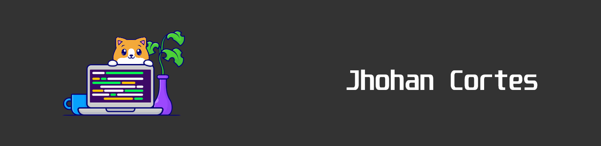

	

	
	

## 😼 &nbsp;About Me:

👋 &nbsp;Hello! I'm Jhohan, a Full Stack developer with experience in technologies such as ReactJS, NextJS, Node.js, Express.js, SQL, PostgreSQL, Sequelize, Figma, and TailwindCSS.

🔍 &nbsp;Currently, I am actively seeking opportunities to grow as a developer, either in Full Stack roles or other challenging projects.

🌱 &nbsp;I am passionate about solving complex problems in the software industry and expanding my expertise in various development areas.

💼 &nbsp;I have worked on several short-term projects that have allowed me to become familiar with different technologies and approaches.

📄 &nbsp;You can find more details about my education and skills on my LinkedIn profile: <a href="https://www.linkedin.com/in/jhohan-cortes-a314a8213/">Jhohan Cortes on LinkedIn</a>.

🤝 &nbsp;I am always open to new opportunities and collaborations, so feel free to contact me!

 

## 🛠 &nbsp;Tech Stack:

### 💻 &nbsp;Languages:

&nbsp;
&nbsp;
&nbsp;

### 🚀 &nbsp;Technologies:

&nbsp;
&nbsp;
&nbsp;
&nbsp;
&nbsp;
&nbsp;
&nbsp;
&nbsp;
&nbsp;

## 📈 Statistics

 

  
  

## 📕 Pinned Repositories
